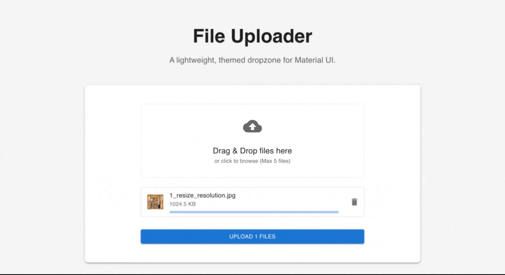

# mui-file-uploader-pro

A lightweight, customizable file uploader component for React using Material-UI (MUI). Features drag-and-drop support, file previews (images, videos), progress tracking, and full theme customization.

## Demo

[https://winglunlam.github.io/mui-file-uploader-pro/](https://winglunlam.github.io/mui-file-uploader-pro/)

---

## Showcase


---

## Key Features

- 📁 **Drag & Drop Support** - Intuitive drag-and-drop file uploads
- 🖼️ **Smart Previews** - Auto-generates previews for images and videos (first frame)
- 🎨 **Fully Customizable** - Customize upload area, icons, text, and theme
- ☁️ **AWS S3 Upload** - Optional multipart upload support for direct S3 uploads (optional)
- 📦 **TypeScript Support** - Built with TypeScript for better developer experience
- 🎭 **Material-UI Styled** - Seamless integration with MUI theme system
- ⚡ **Lightweight** - Minimal dependencies, fast and performant
- 📱 **Responsive** - Works perfectly on all screen sizes

## Installation

### Prerequisites

Before installing `mui-file-uploader-pro`, make sure you have the required peer dependencies installed:

```bash
npm install @mui/material @mui/icons-material @emotion/react @emotion/styled
```

### Install the Package

```bash
npm install mui-file-uploader-pro
```

---

## Quick Start

```tsx
import React, { useState } from 'react';
import { ThemeProvider, CssBaseline, Container, Typography, Box, Paper } from '@mui/material';
import { FileUploader, createUploaderTheme, FileStatus } from 'mui-file-uploader-pro';

const theme = createUploaderTheme({
  palette: {
    primary: { main: '#1976d2' },
    background: { default: '#f5f5f5' }
  },
});

export const App = () => {
  const [uploadStatus, setUploadStatus] = useState<string>('');

  const handleUploadClick = (files: FileStatus[], updateProgress: (fileId: string, progress: number) => void) => {
    setUploadStatus('Uploading...');
    
    // Send files to your API
    files.forEach(fileObj => {
      console.log(`Uploading: ${fileObj.file.name}`);
      
      // Simulate upload progress
      let progress = 0;
      const interval = setInterval(() => {
        progress += Math.random() * 30;
        if (progress >= 100) {
          progress = 100;
          clearInterval(interval);
        }
        updateProgress(fileObj.id, progress);
      }, 500);
    });
    
    setTimeout(() => {
      setUploadStatus('Success!');
    }, 3000);
  };

  const handleDeleteClick = (files: FileStatus[], id: string) => {
    return files.filter(f => f.id !== id);
  }

  return (
    <ThemeProvider theme={theme}>
      <CssBaseline />
      <Container maxWidth="md" sx={{ py: 8 }}>
        <Box textAlign="center" mb={6}>
          <Typography variant="h3" fontWeight="bold" gutterBottom>
            File Uploader
          </Typography>
          <Typography variant="h6" color="text.secondary">
            A lightweight, themed dropzone for Material UI.
          </Typography>
        </Box>

        <Paper elevation={3} sx={{ p: 4, borderRadius: 2 }}>
          <FileUploader
            maxFiles={5}
            accept="*"
            onUpload={handleUploadClick}
            onDelete={handleDeleteClick}
          />
          
          {uploadStatus && (
            <Typography 
              textAlign="center" 
              color="primary" 
              sx={{ mt: 2, fontWeight: 'bold' }}
            >
              {uploadStatus}
            </Typography>
          )}
        </Paper>
      </Container>
    </ThemeProvider>
  );
};
```

---

## Props Documentation

### `FileUploader` Component

The main component for file uploads with drag-and-drop support.

#### FileUploaderProps

| Prop | Type | Required | Default | Description |
|------|------|----------|---------|-------------|
| `onUpload` | `(files: FileStatus[], updateProgress: (fileId: string, progress: number) => void) => void` | No | - | Callback triggered when user clicks the Upload button. Receives FileStatus array with file metadata and an `updateProgress` function to update individual file progress (0-100). Not used if `s3Config` is provided. |
| `onDelete` | `(files: FileStatus[], id: string) => FileStatus[]` | No | - | Callback when a file is deleted. Receives current files array and file ID. Must return updated files array. |
| `maxFiles` | `number` | No | `5` | Maximum number of files allowed in the uploader. |
| `accept` | `string` | No | `"*"` | File type filter (e.g., "image/*", "image/*,video/*", ".pdf"). |
| `renderUploadArea` | `(isDragging: boolean) => React.ReactNode` | No | - | Custom render function for the entire upload area. Receives dragging state. |
| `uploadAreaIcon` | `React.ReactNode` | No | `CloudUploadIcon` | Custom icon for the upload area. |
| `uploadAreaTitle` | `React.ReactNode` | No | `"Drag & Drop files here"` | Custom title text for the upload area. |
| `uploadAreaSubtitle` | `React.ReactNode` | No | `"or click to browse (Max {maxFiles} files)"` | Custom subtitle text for the upload area. |
| `s3Config` | `S3Config` | No | - | AWS S3 multipart upload configuration. If provided, enables S3 upload instead of using `onUpload`. See S3 Upload section for details. |

#### FileStatus

Object representing a file in the uploader.

```typescript
interface FileStatus {
  file: File;                                    // The actual File object
  id: string;                                    // Unique identifier for the file
  progress: number;                              // Upload progress (0-100)
  status: 'pending' | 'uploading' | 'completed' | 'error';  // File status
  previewUrl?: string;                           // Preview image URL (auto-generated for images/videos)
  onDelete?: (id: string) => void;              // Delete callback
}
```

---

## Progress Tracking in onUpload

The `onUpload` callback receives the `FileStatus` array with file metadata (including unique IDs) and an `updateProgress` callback function that lets you update individual file progress.

### Basic Example with Simulated Upload

```tsx
const handleUpload = (files: FileStatus[], updateProgress: (fileId: string, progress: number) => void) => {
  files.forEach(fileObj => {
    // Simulate upload progress
    for (let i = 0; i <= 100; i += 10) {
      setTimeout(() => {
        updateProgress(fileObj.id, i);
      }, i * 200);
    }
  });
};

<FileUploader
  onUpload={handleUpload}
  onDelete={handleDelete}
/>
```

---

## Customization Examples

### 1. Basic Upload Area Customization

Customize individual elements of the upload area:

```tsx
import { FileUploader } from 'mui-file-uploader-pro';
import { CloudDone } from '@mui/icons-material';

<FileUploader
  maxFiles={10}
  uploadAreaIcon={<CloudDone sx={{ fontSize: 64, color: 'success.main' }} />}
  uploadAreaTitle="Upload your files!"
  uploadAreaSubtitle="Drag files here or click to select"
  onUpload={handleUpload}
  onDelete={handleDelete}
/>
```

### 2. Complete Custom Upload Area

Provide a fully custom render function:

```tsx
<FileUploader
  maxFiles={5}
  renderUploadArea={(isDragging) => (
    <Box
      sx={{
        p: 4,
        textAlign: 'center',
        backgroundColor: isDragging ? 'primary.light' : 'background.paper',
        border: isDragging ? '3px solid' : '2px dashed',
        borderColor: isDragging ? 'primary.main' : 'divider',
        borderRadius: 2,
        transition: 'all 0.2s ease'
      }}
    >
      <CloudUploadIcon sx={{ fontSize: 56, color: 'primary.main', mb: 2 }} />
      <Typography variant="h5" fontWeight="bold">
        {isDragging ? 'Drop it here!' : 'Drop files to upload'}
      </Typography>
      <Typography variant="body2" color="text.secondary" mt={1}>
        Supporting images, videos, and documents
      </Typography>
    </Box>
  )}
  onUpload={handleUpload}
  onDelete={handleDelete}
/>
```

### 3. Icon-Only Upload Area

```tsx
import { CloudUpload } from '@mui/icons-material';

<FileUploader
  maxFiles={5}
  uploadAreaIcon={<CloudUpload sx={{ fontSize: 80 }} />}
  uploadAreaTitle="Drop files here"
  onUpload={handleUpload}
  onDelete={handleDelete}
/>
```

---

## Theme Customization

The FileUploader integrates seamlessly with Material-UI's theming system using `createUploaderTheme`.

### Basic Theme Customization

```tsx
import { createUploaderTheme } from 'mui-file-uploader-pro';
import { ThemeProvider } from '@mui/material/styles';

const customTheme = createUploaderTheme({
  palette: {
    primary: {
      main: '#2196f3',
    },
    secondary: {
      main: '#f50057',
    },
    background: {
      default: '#fafafa',
      paper: '#ffffff',
    },
  },
});

export const App = () => (
  <ThemeProvider theme={customTheme}>
    <FileUploader
      maxFiles={5}
      onUpload={handleUpload}
      onDelete={handleDelete}
    />
  </ThemeProvider>
);
```

### Dark Theme Example

```tsx
const darkTheme = createUploaderTheme({
  palette: {
    mode: 'dark',
    primary: {
      main: '#90caf9',
    },
    background: {
      default: '#121212',
      paper: '#1e1e1e',
    },
  },
});

<ThemeProvider theme={darkTheme}>
  <FileUploader maxFiles={5} onUpload={handleUpload} />
</ThemeProvider>
```

---

## Complete Example with All Features

```tsx
import React, { useState } from 'react';
import {
  ThemeProvider,
  CssBaseline,
  Container,
  Typography,
  Box,
  Paper,
  Dialog,
  DialogTitle,
  DialogContent,
  DialogActions,
  Button,
} from '@mui/material';
import ImageIcon from '@mui/icons-material/Image';
import { FileStatus } from 'mui-file-uploader-pro';
import { FileUploader, createUploaderTheme } from 'mui-file-uploader-pro';

const theme = createUploaderTheme({
  palette: {
    primary: { main: '#1976d2' },
    background: { default: '#f5f5f5' },
  },
});

export const App = () => {
  const [uploadStatus, setUploadStatus] = useState<string>('');
  const [openDialog, setOpenDialog] = useState(false);
  const [selectedFile, setSelectedFile] = useState<File | null>(null);

  const handleUploadClick = async (files: FileStatus[], updateProgress: (fileId: string, progress: number) => void) => {
    setUploadStatus('Uploading...');
    
    // Upload each file and update progress
    for (const fileObj of files) {
      try {
        // Simulate API upload with progress updates
        for (let i = 0; i <= 100; i += 10) {
          updateProgress(fileObj.id, i);
          await new Promise(resolve => setTimeout(resolve, 200));
        }
      } catch (error) {
        console.error(`Upload failed for ${fileObj.file.name}`, error);
      }
    }
    
    setUploadStatus(`Successfully uploaded ${files.length} file(s)`);
    setTimeout(() => setUploadStatus(''), 3000);
  };

  const handleDeleteClick = (files: FileStatus[], id: string) => {
    setUploadStatus(`Deleted file`);
    return files.filter(f => f.id !== id);
  };

  return (
    <ThemeProvider theme={theme}>
      <CssBaseline />
      <Container maxWidth="md" sx={{ py: 8 }}>
        <Box textAlign="center" mb={6}>
          <Typography variant="h3" fontWeight="bold" gutterBottom>
            📁 File Uploader Pro
          </Typography>
          <Typography variant="h6" color="text.secondary">
            Drag, drop, preview, and upload files with ease
          </Typography>
        </Box>

        <Paper elevation={3} sx={{ p: 4, borderRadius: 2 }}>
          <FileUploader
            maxFiles={5}
            accept="image/*,video/*,.pdf"
            uploadAreaIcon={<ImageIcon sx={{ fontSize: 64, color: 'primary.main' }} />}
            uploadAreaTitle="Upload Images, Videos, or PDFs"
            uploadAreaSubtitle="Drag files here or click to browse"
            onUpload={handleUploadClick}
            onDelete={handleDeleteClick}
          />
          
          {uploadStatus && (
            <Typography 
              textAlign="center" 
              color="primary" 
              sx={{ mt: 3, fontWeight: 'bold', fontSize: '1.1rem' }}
            >
              ✓ {uploadStatus}
            </Typography>
          )}
        </Paper>
      </Container>
    </ThemeProvider>
  );
};
```

---

## AWS S3 Multipart Upload (Optional)

The FileUploader supports optional AWS S3 multipart upload for large files. This feature allows you to upload directly to S3 with progress tracking.

### How It Works

1. Frontend initiates multipart upload via your backend API
2. Backend returns an Upload ID
3. Frontend splits file into chunks (default: 5MB each)
4. For each chunk, frontend gets a presigned URL from your backend
5. Frontend uploads each chunk directly to S3
6. Frontend completes the multipart upload via your backend API

### Backend Requirements

Your backend needs to provide three API endpoints:

```typescript
// Initiate multipart upload
POST /api/s3/initiate
Request: { fileKey: string, mimeType: string }
Response: { uploadId: string }

// Get presigned URL for uploading a part
POST /api/s3/presigned-url
Request: { fileKey: string, partNumber: number, uploadId: string }
Response: { presignedUrl: string }

// Complete multipart upload
POST /api/s3/complete
Request: { fileKey: string, uploadId: string, parts: Array<{ partNumber: number, eTag: string }> }
Response: void
```

### Frontend Usage

```tsx
import React from 'react';
import { FileUploader } from 'mui-file-uploader-pro';

export const S3UploaderExample = () => {
  const s3Config = {
    initiateMultipartApi: async (fileKey, mimeType) => {
      const response = await fetch('/api/s3/initiate', {
        method: 'POST',
        headers: { 'Content-Type': 'application/json' },
        body: JSON.stringify({ fileKey, mimeType })
      });
      const data = await response.json();
      return data.uploadId;
    },

    getPresignedUrlApi: async (fileKey, partNumber, uploadId) => {
      const response = await fetch('/api/s3/presigned-url', {
        method: 'POST',
        headers: { 'Content-Type': 'application/json' },
        body: JSON.stringify({ fileKey, partNumber, uploadId })
      });
      const data = await response.json();
      return data.presignedUrl;
    },

    completeMultipartApi: async (fileKey, uploadId, parts) => {
      await fetch('/api/s3/complete', {
        method: 'POST',
        headers: { 'Content-Type': 'application/json' },
        body: JSON.stringify({ fileKey, uploadId, parts })
      });
    },

    generateFileKey: (file) => {
      // Custom key generation - e.g., add timestamp or user ID
      return `uploads/${Date.now()}-${file.name}`;
    },

    partSize: 5 * 1024 * 1024, // 5MB (default)
  };

  return (
    <FileUploader
      maxFiles={5}
      accept="*"
      s3Config={s3Config}
      uploadAreaTitle="Upload to S3"
      uploadAreaSubtitle="Drag files here for direct S3 upload"
    />
  );
};
```

### FileStatus with S3 Upload

When using S3 multipart upload, `FileStatus` includes additional fields:

```typescript
interface FileStatus {
  // ... existing fields
  file: File;
  id: string;
  progress: number;
  status: 'pending' | 'uploading' | 'completed' | 'error';
  previewUrl?: string;

  // S3 multipart specific
  s3UploadId?: string;                              // Upload ID from S3
  s3Parts?: Array<{ partNumber: number; eTag: string }>; // Uploaded parts
}
```

### Backend Example (Node.js with Express)

```javascript
const aws = require('aws-sdk');
const s3 = new aws.S3({
  accessKeyId: process.env.AWS_ACCESS_KEY_ID,
  secretAccessKey: process.env.AWS_SECRET_ACCESS_KEY,
  region: process.env.AWS_REGION,
});

// Initiate multipart upload
app.post('/api/s3/initiate', async (req, res) => {
  const { fileKey, mimeType } = req.body;
  try {
    const params = {
      Bucket: process.env.AWS_BUCKET,
      Key: fileKey,
      ContentType: mimeType,
    };
    const multipart = await s3.createMultipartUpload(params).promise();
    res.json({ uploadId: multipart.UploadId });
  } catch (error) {
    res.status(500).json({ error: error.message });
  }
});

// Get presigned URL
app.post('/api/s3/presigned-url', async (req, res) => {
  const { fileKey, partNumber, uploadId } = req.body;
  try {
    const params = {
      Bucket: process.env.AWS_BUCKET,
      Key: fileKey,
      PartNumber: partNumber,
      UploadId: uploadId,
      Expires: 3600, // 1 hour
    };
    const presignedUrl = s3.getSignedUrl('uploadPart', params);
    res.json({ presignedUrl });
  } catch (error) {
    res.status(500).json({ error: error.message });
  }
});

// Complete multipart upload
app.post('/api/s3/complete', async (req, res) => {
  const { fileKey, uploadId, parts } = req.body;
  try {
    const params = {
      Bucket: process.env.AWS_BUCKET,
      Key: fileKey,
      UploadId: uploadId,
      MultipartUpload: {
        // Map the parts to ensure keys are Uppercase
        Parts: parts.map(part => ({
          ETag: part.eTag || part.ETag, // Handle both just in case
          PartNumber: parseInt(part.partNumber || part.PartNumber)
        })).sort((a, b) => a.PartNumber - b.PartNumber) // S3 requires parts to be in order
      },
    };
    await s3.completeMultipartUpload(params).promise();
    res.json({ success: true });
  } catch (error) {
    res.status(500).json({ error: error.message });
  }
});
```

### S3Config Props

| Prop | Type | Required | Description |
|------|------|----------|-------------|
| `initiateMultipartApi` | `(fileKey: string, mimeType: string) => Promise<string>` | Yes | API to initiate multipart upload. Returns Upload ID. |
| `getPresignedUrlApi` | `(fileKey: string, partNumber: number, uploadId: string) => Promise<string>` | Yes | API to get presigned URL for uploading a part. |
| `completeMultipartApi` | `(fileKey: string, uploadId: string, parts: Array<{ partNumber: number; eTag: string }>) => Promise<void>` | Yes | API to complete multipart upload. |
| `generateFileKey` | `(file: File) => string` | No | Custom function to generate S3 key. Default: uses file name. |
| `partSize` | `number` | No | Part size in bytes. Default: 5MB (5242880). |

---

## License

MIT License - see LICENSE file for details

---

## Contributing

Contributions are welcome! Please feel free to submit a Pull Request.
